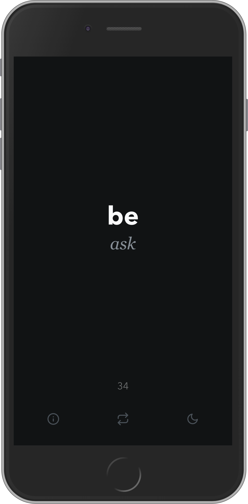
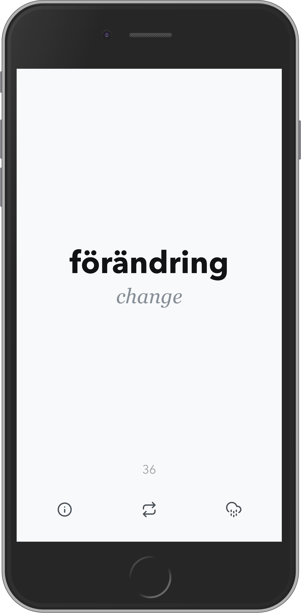
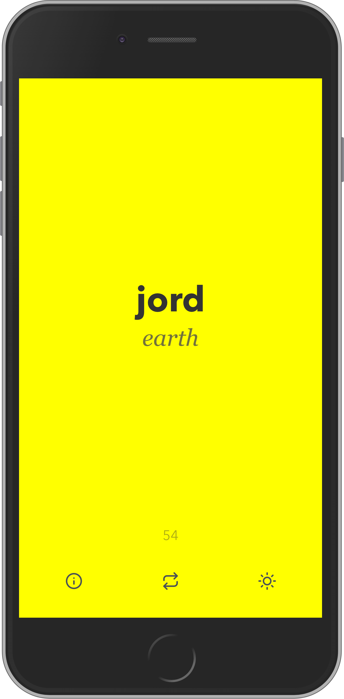
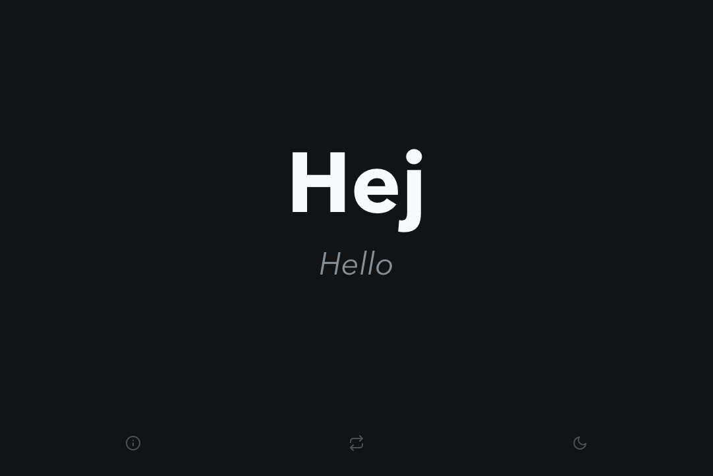
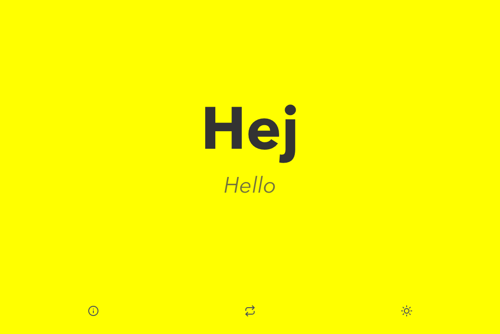

   

# Spanish word of the day

Another _"Word of the day website"_... I know.

## What

A project to test/learn more about some technologies:

- React
- Typescript

## Features

- Display the word Spanish and it translation in Swedish

## Themes

| Night                                          | Cloudy                                           | Sunny                                          |
| ---------------------------------------------- | ------------------------------------------------ | ---------------------------------------------- |
|  |  |  |
|         |         |         |
